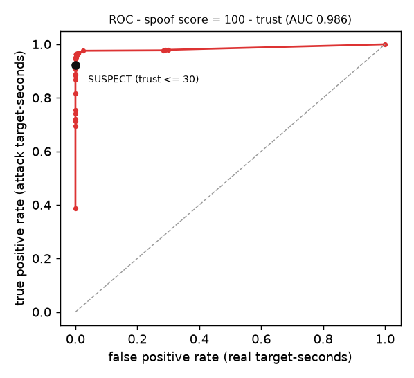
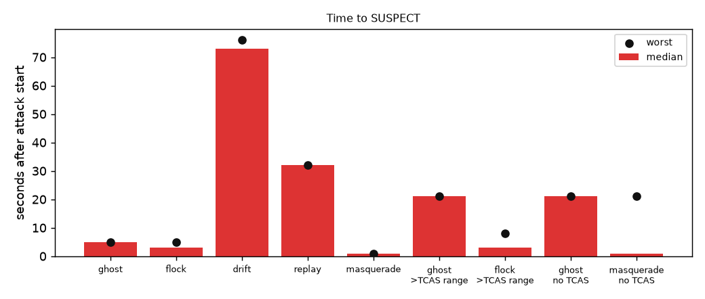
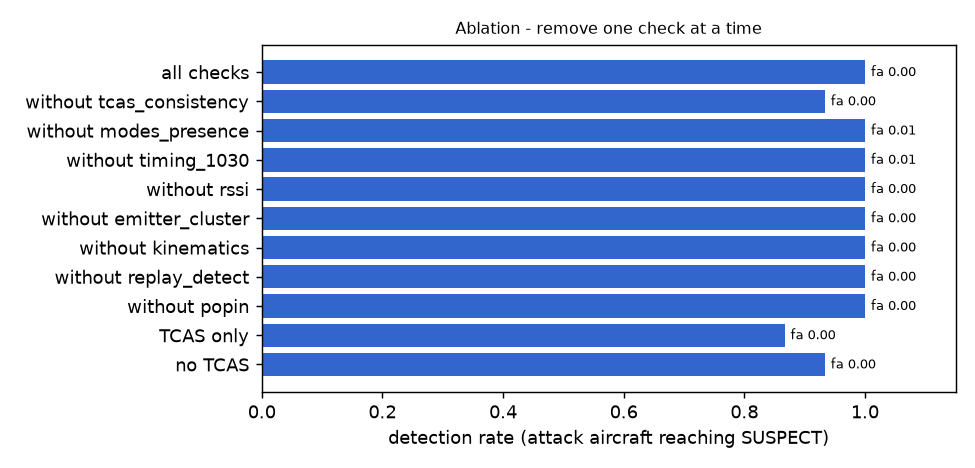

# ARC verification - evaluation

`python eval/run_eval.py --seeds 4` · 4 seeds per attack · attack at t = 30 s · 150 s per run · live KDVT traffic (5-8 AI aircraft, runway 07) · judge A's onboard unit · 363 s wall time

Simulated sensors (world/sensors.py) and attacks (world/attacks.py); ground truth never reaches the unit. Numbers describe this simulation, not certified performance - see docs/limitations.md.

## Per attack

| attack | attack aircraft | detected | median / worst time to SUSPECT | real aircraft ever SUSPECT | real target-time SUSPECT | real target-time VERIFIED |
|---|---|---|---|---|---|---|
| none | 0 | – | – | 0 % of 31 | 0 % | 99 % |
| ghost | 4 | 100 % | 5 s / 5 s | 0 % of 31 | 0 % | 99 % |
| flock | 16 | 100 % | 3 s / 5 s | 0 % of 31 | 0 % | 99 % |
| drift | 4 | 100 % | 73 s / 76 s | 0 % of 31 | 0 % | 99 % |
| replay | 4 | 100 % | 32 s / 32 s | 0 % of 31 | 0 % | 99 % |
| masquerade | 4 | 100 % | 1 s / 1 s | 0 % of 31 | 0 % | 99 % |
| ghost beyond TCAS (14 NM) | 4 | 100 % | 21 s / 21 s | 0 % of 31 | 0 % | 99 % |
| flock beyond TCAS (14 NM) | 16 | 100 % | 3 s / 8 s | 0 % of 31 | 0 % | 99 % |
| ghost, own TCAS off | 4 | 100 % | 21 s / 21 s | 0 % of 31 | 0 % | 100 % |
| masquerade, own TCAS off | 4 | 100 % | 1 s / 21 s | 0 % of 31 | 0 % | 98 % |
| quiet, own TCAS off | 0 | – | – | 0 % of 31 | 0 % | 100 % |

Replay re-broadcasts positions 60 s old, so it only starts transmitting ~30 s after the attack is switched on (t = 60 s): it is SUSPECT ~2 s after its first message. Without TCAS a lone ghost waits out the 20 s Mode S listening window; a flock is caught sooner by its shared transmitter.

## Whole-picture attacks (banners)

| attack | banner | raised (median after start) | real aircraft ever SUSPECT |
|---|---|---|---|
| jamming | TRAFFIC PICTURE DEGRADED | 4/4 runs, 1 s | 0 % |
| gps | OWN POSITION UNCERTAIN | 4/4 runs, 27 s | 0 % |

False banners in the 44 other runs: 0.

## ROC

AUC 0.986 over every target-second after the attack starts (attack aircraft vs real aircraft). The operating point is SUSPECT = trust ≤ 30, plus the guardrails (a TCAS-confirmed target is never SUSPECT; SUSPECT needs one strong check).

## Time to detect

Drift is slow by design: the attack walks the position 12 m/s, and ARC flags it once the offset exceeds what TCAS noise can explain (yellow first, then red).

## Ablation - why fusion beats any single check

| configuration | detection | real aircraft ever SUSPECT | median time to detect |
|---|---|---|---|
| all checks | 100 % | 0 % | 5 s |
| without tcas_consistency | 93 % | 0 % | 3 s |
| without modes_presence | 100 % | 1 % | 5 s |
| without timing_1030 | 100 % | 1 % | 5 s |
| without rssi | 100 % | 0 % | 5 s |
| without emitter_cluster | 100 % | 0 % | 5 s |
| without kinematics | 100 % | 0 % | 5 s |
| without replay_detect | 100 % | 0 % | 5 s |
| without popin | 100 % | 0 % | 5 s |
| TCAS only | 87 % | 0 % | 5 s |
| no TCAS | 93 % | 0 % | 3 s |

Ablation runs: ghost, flock, drift, replay, masquerade, a quiet run and the five hard cases (beyond TCAS range / own TCAS off), fewer seeds than above. 'TCAS only' does well inside TCAS range and fails the hard cases; the other checks carry those.
